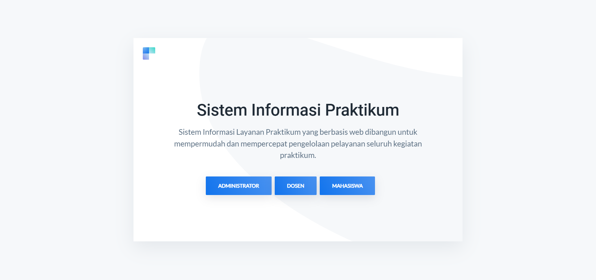

# SISTEM PRAKTIKUM MAHASISWA UNIVERSITAS | Laravel + Bootstrap + javascript

Sistem Praktikum Universitas merupakan Website Berbasis Framework yang memungkinkan melakukan pembelajaran praktikum dengan mengunakan wadah website untuk menampung Informasi Praktikum dan Tugas Tugas Praktikum.

## Fitur

- Mobile Responsive Bootstrap Design
- Role (Mahasiswa,Dosen,Admin)
- Manajemen Data Akademik ( Semester,Mata Kuliah,SKS,Tugas Mahasiswa,Dosen,Jadwal Praktikum )
- Sistem Asisten Dosen
- Laporan Export & Import ( PDF & Excel )

## Teknologi

**Design:** HTML, CSS, JavaScript, Bootstrap 

**Framework:** PHP, Laravel 

**DataBase:** MySql

## AKSES REPOSITORY

**HALAMAN UTAMA**

**INVENTARIS DASHBOARD**

## Feedback

Berikan feedback atau Ingin Memproleh SourceCode:

**EMAIL DEVELOPER :** 

mikozua45@gmail.com

